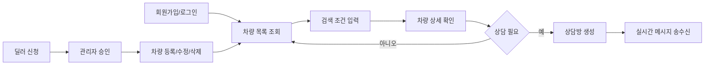

# 실시간 Car Market 프로젝트 개요

## 1. 프로젝트 소개

실시간 Car Market은 기존 자동차 CRUD 애플리케이션을 확장해, 사용자가 차량을 검색하고 딜러와 실시간 상담할 수 있도록 만든 중고차 마켓 서비스다.

초기 과제의 핵심은 자동차 목록 조회, 등록, 수정, 삭제였지만, 최종 구현에서는 MongoDB Atlas, Firebase Authentication, Socket.io, 이미지 업로드, 관리자/딜러 권한 관리까지 포함해 실제 서비스에 가까운 구조로 발전시켰다.

## 2. 개발 목표

| 목표 | 설명 |
| --- | --- |
| 차량 탐색 기능 구현 | 사용자가 차량명, 제조사, 가격, 연식 등 조건으로 원하는 차량을 찾을 수 있게 한다. |
| 딜러 중심 등록 구조 | 승인된 딜러만 차량을 등록, 수정, 삭제할 수 있게 제한한다. |
| 인증 기반 서비스 구성 | Firebase 로그인 상태를 기준으로 사용자별 화면과 API 권한을 나눈다. |
| 실시간 상담 제공 | 차량 상세 화면에서 상담방을 만들고 Socket.io로 메시지를 주고받는다. |
| 단일 서비스 배포 | Render Web Service 하나에서 Express 서버와 React 빌드 결과물을 함께 제공한다. |

## 3. 사용자 유형

| 사용자 | 주요 권한 | 사용 흐름 |
| --- | --- | --- |
| 일반 사용자 | 차량 검색, 상세 조회, 상담 요청 | 회원가입 후 원하는 차량을 검색하고 딜러와 상담한다. |
| 딜러 | 차량 등록, 수정, 삭제, 상담 응답 | 관리자 승인 후 차량을 관리하고 상담 메시지에 응답한다. |
| 관리자 | 사용자 목록 확인, 딜러 승인, 역할 관리 | 딜러 신청을 확인하고 사용자 권한을 조정한다. |

## 4. 핵심 기능 범위

### 4.1 차량 기능

- 차량 목록 조회
- 차량 상세 조회
- 차량명, 제조사, 가격, 연식 조건 검색
- 차량 등록, 수정, 삭제
- 다중 차량 이미지 업로드
- 이미지가 없는 차량의 기본 이미지 처리

### 4.2 인증과 권한

- Firebase 이메일/비밀번호 회원가입
- Firebase 로그인, 로그아웃, 인증 상태 유지
- MongoDB `users` 컬렉션에 사용자 프로필 저장
- `buyer`, `dealer`, `admin` 역할 구분
- 딜러 신청과 관리자 승인 흐름

### 4.3 실시간 상담

- 차량 상세 화면에서 상담방 생성
- 상담방 목록 조회
- 이전 메시지 조회
- Socket.io 기반 메시지 송수신
- 딜러 온라인/오프라인 상태 표시
- 향후 AI 상담 보조 기능을 붙일 수 있도록 메시지 처리 로직 분리

## 5. 전체 서비스 흐름

## 6. 기술 스택

| 구분 | 사용 기술 | 선택 이유 |
| --- | --- | --- |
| 프론트엔드 | React, Vite | 컴포넌트 기반 화면 구성과 빠른 개발 서버를 사용하기 위해 선택했다. |
| 스타일 | Tailwind CSS | 별도 UI 라이브러리 의존을 줄이고 화면 톤을 직접 조정하기 위해 사용했다. |
| 백엔드 | Node.js, Express | REST API와 정적 파일 제공을 같은 서버에서 처리하기 쉽다. |
| 데이터베이스 | MongoDB Atlas | 차량, 사용자, 상담 데이터를 문서 형태로 저장하기 적합하다. |
| 인증 | Firebase Authentication | 이메일/비밀번호 인증과 토큰 검증 흐름을 안정적으로 구성할 수 있다. |
| 실시간 통신 | Socket.io | 브라우저와 서버 간 실시간 상담 메시지를 처리하기 위해 사용했다. |
| 파일 업로드 | multer | 차량 이미지 업로드를 Express 서버에서 처리하기 위해 사용했다. |
| 배포 | Render | 프론트엔드 빌드 파일과 Express 서버를 단일 Web Service로 배포하기 위해 사용했다. |

## 7. 개발 범위와 제외 범위

| 구분 | 내용 |
| --- | --- |
| 포함 | 차량 CRUD, 복합 검색, 사진 업로드, Firebase 인증, 딜러 승인, 관리자 화면, 실시간 상담, Render 배포 문서 |
| 제외 | 결제, 외부 차량 시세 API, 실제 AI Agent API 연동, 외부 이미지 스토리지, 다크 모드 |

