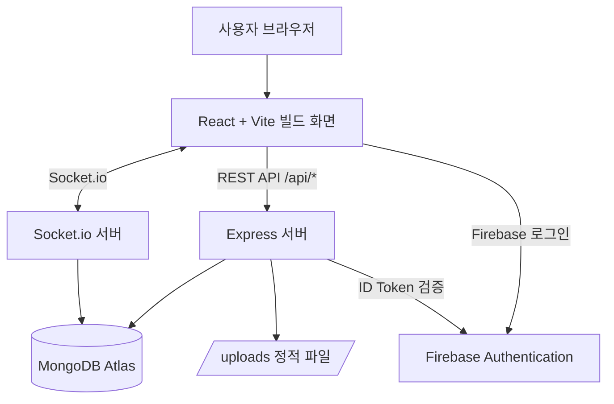
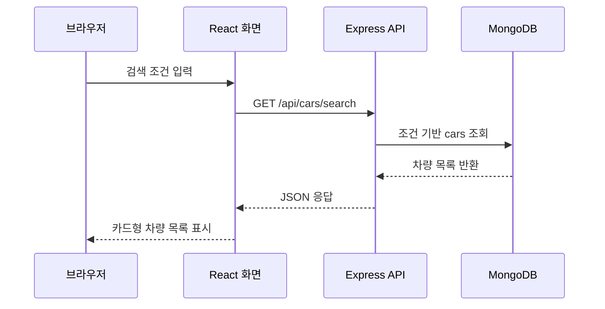
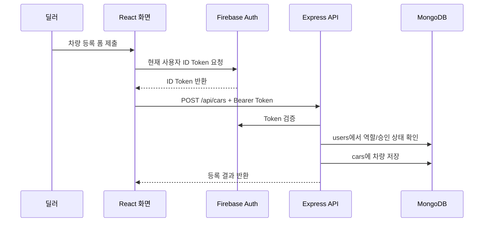
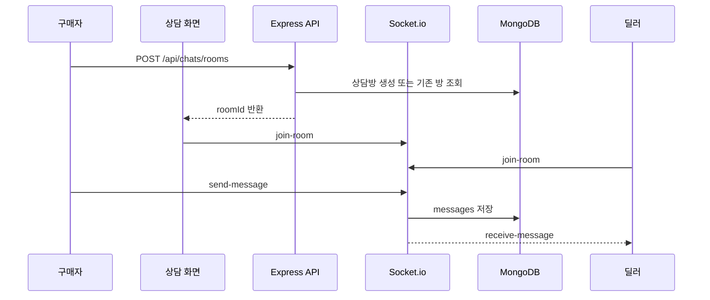

# 실시간 Car Market 시스템 설계서

## 1. 전체 아키텍처

본 프로젝트는 프론트엔드와 백엔드를 하나의 저장소에서 관리하며, 배포 시에는 Express 서버가 React 빌드 결과물을 정적 파일로 제공한다. API 요청은 `/api/*` 경로로 처리하고, 상담 메시지는 Socket.io 연결을 통해 처리한다.



## 2. 주요 구성 요소

| 영역 | 파일/폴더 | 역할 |
| --- | --- | --- |
| 서버 진입점 | `backend/server.js` | Express 앱 생성, 라우터 연결, 정적 파일 제공, Socket.io 초기화 |
| DB 연결 | `backend/db.js` | MongoDB Atlas 연결과 컬렉션 준비 |
| 라우터 | `backend/routes/*.routes.js` | API 경로별 요청 처리 |
| 서비스 | `backend/services/*.service.js` | 차량, 사용자, 상담, 설정 등 실제 비즈니스 로직 처리 |
| 인증 미들웨어 | `backend/middleware/auth.js` | Firebase ID Token 검증과 권한 확인 |
| 에러 미들웨어 | `backend/middleware/errors.js` | API 오류 응답 형식 정리 |
| 소켓 처리 | `backend/sockets/chat.socket.js` | 상담방 입장, 메시지 송수신, 딜러 접속 상태 처리 |
| 프론트엔드 | `frontend/src` | 화면 컴포넌트, 인증 컨텍스트, API 호출, 스타일 |

## 3. 폴더 구조

```text
codex_assignment/
  backend/
    config/
    middleware/
    routes/
    services/
    sockets/
    utils/
    db.js
    server.js
  frontend/
    src/
      api/
      components/
      contexts/
      utils/
      App.jsx
      firebase.js
      main.jsx
      style.css
  docs/
    plans/
    steps/
    pr/
```

## 4. 요청 처리 흐름

### 4.1 차량 목록과 검색



### 4.2 인증이 필요한 차량 등록



### 4.3 실시간 상담



## 5. 인증과 권한 설계

| 단계 | 처리 내용 |
| --- | --- |
| 로그인 | Firebase Authentication에서 이메일/비밀번호로 인증한다. |
| 토큰 발급 | 프론트엔드는 Firebase ID Token을 받아 API 요청의 Authorization 헤더에 담는다. |
| 서버 검증 | Express 서버는 Firebase Admin SDK로 ID Token을 검증한다. |
| 프로필 조회 | 검증된 UID로 MongoDB `users` 컬렉션의 사용자 정보를 조회한다. |
| 권한 판단 | API 성격에 따라 `buyer`, `dealer`, `admin` 역할과 딜러 승인 상태를 확인한다. |

## 6. 보안 설계

| 항목 | 적용 방식 |
| --- | --- |
| 인증 정보 | Firebase ID Token은 요청마다 서버에서 검증한다. |
| 권한 제한 | 차량 등록/수정/삭제는 승인된 딜러만 가능하다. |
| 관리자 보호 | 사용자 목록과 역할 변경은 admin만 접근할 수 있다. |
| 입력 검증 | 차량 검색, 가격, 연식, 파일 업로드 조건을 서버에서 검증한다. |
| 파일 업로드 | 이미지 확장자와 용량을 제한한다. |
| 에러 응답 | 내부 스택, 환경변수, DB 접속 문자열은 응답에 노출하지 않는다. |

## 7. Render 단일 배포 구조

| 항목 | 내용 |
| --- | --- |
| 빌드 명령 | `npm run build` |
| 실행 명령 | `npm start` |
| 서버 실행 파일 | `backend/server.js` |
| 정적 파일 제공 | Express가 `frontend/dist`를 제공 |
| 업로드 경로 | `/uploads` |
| 주의사항 | Render 무료 환경에서는 업로드 파일이 재배포 또는 재시작 후 유지되지 않을 수 있다. |

