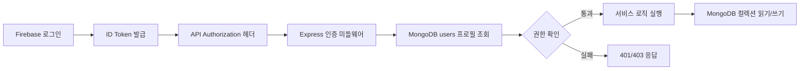

# 실시간 Car Market DB 및 API 명세서

## 1. 데이터베이스 개요

MongoDB Atlas를 사용해 차량, 사용자, 상담방, 메시지 데이터를 저장한다. Firebase Authentication은 로그인 인증을 담당하고, 서비스에서 필요한 사용자 이름, 역할, 딜러 승인 상태는 MongoDB `users` 컬렉션에 별도로 저장한다.

## 2. 컬렉션 설계

### 2.1 cars

| 필드 | 타입 | 설명 |
| --- | --- | --- |
| `_id` | ObjectId | 차량 문서 ID |
| `name` | string | 차량명 |
| `company` | string | 제조사 |
| `price` | number | 가격, 만원 단위 |
| `year` | number | 연식 |
| `type` | string | 차종 |
| `fuel` | string | 연료 |
| `mileage` | number | 주행거리, km 단위 |
| `location` | string | 차량 위치 |
| `description` | string | 차량 설명 |
| `imageUrl` | string | 대표 이미지 경로 |
| `imageUrls` | string[] | 차량 이미지 목록 |
| `dealerId` | string | 등록 딜러 Firebase UID |
| `dealerName` | string | 등록 딜러 이름 |
| `createdAt` | string | 생성 시각 |
| `updatedAt` | string | 수정 시각 |

### 2.2 users

| 필드 | 타입 | 설명 |
| --- | --- | --- |
| `uid` | string | Firebase UID |
| `email` | string | 사용자 이메일 |
| `displayName` | string | 화면 표시 이름 |
| `role` | string | `buyer`, `dealer`, `admin` |
| `dealerStatus` | string | `none`, `pending`, `approved`, `rejected` |
| `dealerRequestedAt` | string | 딜러 신청 시각 |
| `dealerApprovedAt` | string | 딜러 승인 시각 |
| `dealerApprovedBy` | string | 승인한 관리자 UID |
| `createdAt` | string | 가입 시각 |
| `updatedAt` | string | 수정 시각 |

### 2.3 chat_rooms

| 필드 | 타입 | 설명 |
| --- | --- | --- |
| `roomId` | string | 상담방 ID |
| `carId` | string | 상담 대상 차량 ID |
| `buyerId` | string | 구매자 UID |
| `buyerName` | string | 구매자 이름 |
| `dealerId` | string | 딜러 UID |
| `dealerName` | string | 딜러 이름 |
| `lastMessage` | string | 마지막 메시지 내용 |
| `lastMessageAt` | string | 마지막 메시지 시각 |
| `createdAt` | string | 생성 시각 |
| `updatedAt` | string | 수정 시각 |

### 2.4 messages

| 필드 | 타입 | 설명 |
| --- | --- | --- |
| `messageId` | string | 메시지 ID |
| `roomId` | string | 상담방 ID |
| `senderId` | string | 보낸 사용자 UID |
| `senderName` | string | 보낸 사용자 이름 |
| `text` | string | 메시지 내용 |
| `createdAt` | string | 전송 시각 |

### 2.5 dealer_presence

| 필드 | 타입 | 설명 |
| --- | --- | --- |
| `dealerId` | string | 딜러 UID |
| `isOnline` | boolean | 접속 여부 |
| `socketIds` | string[] | 현재 연결된 소켓 ID 목록 |
| `updatedAt` | string | 상태 변경 시각 |

## 3. REST API 명세

### 3.1 차량 API

| Method | Path | 인증 | 설명 |
| --- | --- | --- | --- |
| GET | `/api/cars` | 없음 | 전체 차량 목록 조회 |
| GET | `/api/cars/search` | 없음 | 조건 기반 차량 검색 |
| GET | `/api/cars/:id` | 필요 | 차량 상세 조회 |
| POST | `/api/cars` | 딜러 | 차량 등록 |
| PUT | `/api/cars/:id` | 딜러 | 차량 수정 |
| DELETE | `/api/cars/:id` | 딜러 | 차량 삭제 |

검색 조건 예시:

| Query | 설명 |
| --- | --- |
| `keyword` | 차량명 일부 검색 |
| `company` | 제조사 검색 |
| `minPrice`, `maxPrice` | 가격 범위 |
| `minYear`, `maxYear` | 연식 범위 |

### 3.2 사용자 API

| Method | Path | 인증 | 설명 |
| --- | --- | --- | --- |
| POST | `/api/users` | 필요 | 회원가입 후 사용자 프로필 저장 |
| GET | `/api/users/me` | 필요 | 현재 로그인 사용자 정보 조회 |
| POST | `/api/users/dealer-request` | 필요 | 딜러 승인 신청 |
| GET | `/api/users` | 관리자 | 사용자 목록 조회 |
| PATCH | `/api/users/:uid/role` | 관리자 | 역할과 딜러 승인 상태 변경 |
| GET | `/api/users/dealers` | 없음 | 승인된 딜러 목록 조회 |

### 3.3 상담 API

| Method | Path | 인증 | 설명 |
| --- | --- | --- | --- |
| POST | `/api/chats/rooms` | 필요 | 차량 기준 상담방 생성 또는 기존 방 반환 |
| GET | `/api/chats/rooms` | 필요 | 내 상담방 목록 조회 |
| GET | `/api/chats/rooms/:roomId` | 필요 | 상담방 상세 조회 |
| GET | `/api/chats/rooms/:roomId/messages` | 필요 | 상담방 메시지 목록 조회 |

## 4. Socket.io 이벤트 명세

| 이벤트 | 방향 | 설명 |
| --- | --- | --- |
| `join-room` | Client → Server | 상담방에 입장한다. |
| `send-message` | Client → Server | 메시지를 서버로 전송한다. |
| `receive-message` | Server → Client | 저장된 메시지를 상담방 참여자에게 전달한다. |
| `leave-room` | Client → Server | 상담방에서 나간다. |
| `dealer-online` | Server → Client | 딜러가 온라인 상태임을 알린다. |
| `dealer-offline` | Server → Client | 딜러가 오프라인 상태임을 알린다. |
| `chat-error` | Server → Client | 상담 처리 중 오류를 전달한다. |

## 5. API 응답과 오류 처리 기준

| 상황 | 상태 코드 | 처리 |
| --- | --- | --- |
| 정상 조회 | 200 | 조회 결과를 JSON으로 반환 |
| 정상 생성 | 201 | 생성된 리소스 정보를 JSON으로 반환 |
| 인증 없음 | 401 | 로그인 필요 메시지 반환 |
| 권한 없음 | 403 | 권한 부족 메시지 반환 |
| 리소스 없음 | 404 | 대상 없음 메시지 반환 |
| 잘못된 입력 | 400 | 입력값 오류 메시지 반환 |
| 서버 오류 | 500 | 내부 정보가 노출되지 않는 오류 메시지 반환 |

## 6. 주요 데이터 흐름

