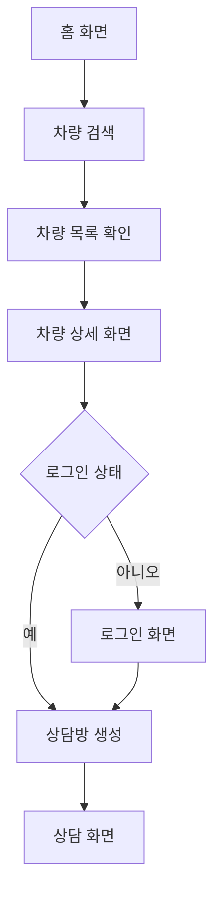
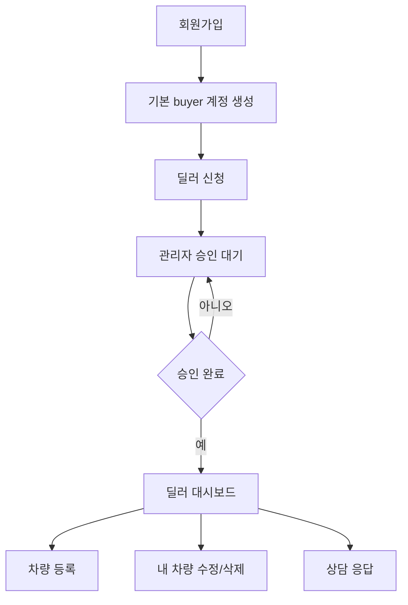
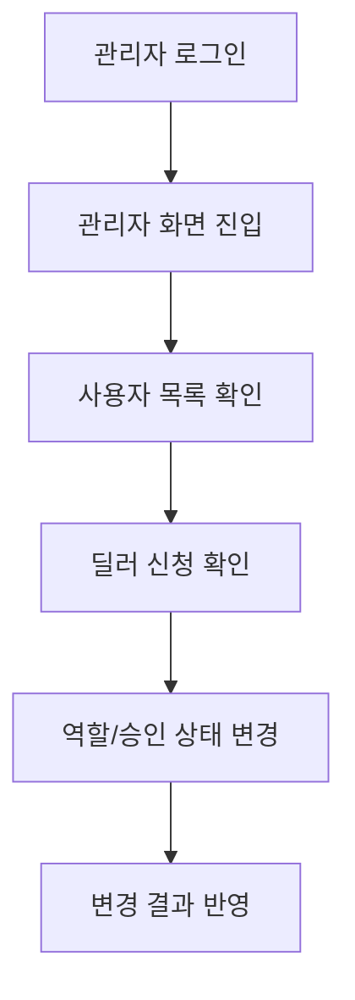

# 실시간 Car Market 화면 흐름 설계서

## 1. UI 설계 방향

초기 화면은 단순 관리자형 CRUD 화면에 가까웠지만, 최종 화면은 사용자가 차량을 둘러보고 상담을 시작하는 마켓플레이스 흐름에 맞춰 재구성했다. 첫 화면에서는 검색과 차량 목록을 중심에 두고, 상세 화면에서는 차량 이미지와 스펙, 상담 진입 버튼을 명확하게 배치했다.

## 2. 공통 화면 구조

| 영역 | 역할 |
| --- | --- |
| Header | 서비스명, 주요 메뉴, 로그인/회원가입/로그아웃, 관리자 진입 |
| Hero | 서비스 첫인상, 검색 시작 흐름, 주요 안내 |
| Search Filter | 차량명, 제조사, 가격, 연식 조건 입력 |
| Inventory | 차량 카드 목록, 가격, 이미지, 주요 스펙, 상세 버튼 |
| Mobile Navigation | 모바일에서 주요 메뉴 접근성을 보완 |

## 3. 사용자별 화면 흐름

### 3.1 일반 사용자

### 3.2 딜러

### 3.3 관리자

## 4. 주요 화면 설계

### 4.1 홈/차량 목록

| 구성 | 설명 |
| --- | --- |
| 프리미엄 Hero | 차량 탐색 서비스의 첫인상을 만들고 주요 CTA를 제공한다. |
| 검색 조건 | 사용자가 원하는 차량을 빠르게 좁힐 수 있도록 주요 조건을 한곳에 배치한다. |
| 차량 카드 | 이미지, 가격, 제조사, 연식, 주행거리, 지역을 카드 안에 정리한다. |
| 빈 결과 안내 | 검색 결과가 없을 때 사용자가 조건을 조정할 수 있도록 안내한다. |

### 4.2 차량 상세

| 구성 | 설명 |
| --- | --- |
| 차량 이미지 | 대표 이미지와 추가 이미지를 통해 차량 상태를 먼저 확인한다. |
| 차량 정보 | 가격, 연식, 주행거리, 연료, 위치 등 구매 판단 정보를 표시한다. |
| 딜러 정보 | 등록 딜러와 상담 가능 여부를 보여준다. |
| 상담 버튼 | 로그인 후 상담방을 만들고 상담 화면으로 이동한다. |

### 4.3 로그인/회원가입

| 구성 | 설명 |
| --- | --- |
| 로그인 | 이메일과 비밀번호로 Firebase 인증을 진행한다. |
| 회원가입 | 사용자 이름, 이메일, 비밀번호를 입력해 계정을 만든다. |
| 프로필 저장 | 회원가입 후 MongoDB에 사용자 정보를 저장한다. |
| 딜러 신청 | 가입 직후 딜러가 되는 것이 아니라, 별도 신청 후 관리자 승인을 받는다. |

### 4.4 상담 화면

| 구성 | 설명 |
| --- | --- |
| 상담방 정보 | 차량과 상대방 정보를 표시한다. |
| 메시지 목록 | 이전 메시지와 새 메시지를 시간순으로 보여준다. |
| 입력창 | 사용자가 메시지를 작성하고 전송한다. |
| 접속 상태 | 딜러 온라인/오프라인 상태를 표시한다. |

### 4.5 관리자 화면

| 구성 | 설명 |
| --- | --- |
| 사용자 목록 | 가입한 사용자와 역할을 확인한다. |
| 딜러 승인 | 신청 상태를 보고 승인 또는 거절한다. |
| 역할 변경 | 필요 시 사용자 역할을 조정한다. |
| 안전장치 | 관리자가 자기 자신의 admin 권한을 해제하지 못하도록 서버에서 방어한다. |

## 5. 반응형 기준

| 화면 크기 | 설계 기준 |
| --- | --- |
| 375px 모바일 | 검색 필터와 차량 카드를 세로로 배치하고, 버튼이 겹치지 않도록 한다. |
| 768px 태블릿 | 카드 그리드를 2열 이상으로 확장하고 필터 영역의 간격을 조정한다. |
| 1280px 이상 데스크톱 | 좌측 필터와 우측 결과 목록을 함께 보여주는 인벤토리형 화면을 사용한다. |

## 6. UI 스타일 기준

| 항목 | 적용 기준 |
| --- | --- |
| 색상 | 코발트 계열의 기본 Tailwind 느낌을 줄이고 `brand-ink`, `brand-deep`, `brand-ocean`, `brand-mint`, `brand-amber` 중심으로 통일했다. |
| 버튼 | 주요 CTA와 보조 버튼을 시각적으로 구분했다. |
| 카드 | 차량 이미지를 먼저 보여주고 가격과 스펙을 빠르게 확인할 수 있게 구성했다. |
| 폰트 | `Pretendard Variable`, `SUIT` 우선 폰트 스택을 적용했다. |
| 다크 모드 | 1차 구현 범위에서는 제외했다. |

