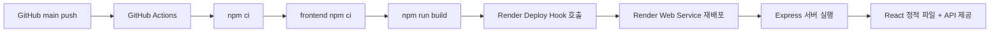

# 실시간 Car Market 개발, 검증, 배포 정리

## 1. 개발 진행 요약

프로젝트는 초기 CRUD 기능에서 출발해 단계적으로 실제 서비스 구조를 갖추는 방식으로 진행했다. 각 단계는 기능 구현 전 계획 문서를 작성하고, 구현 후 작업 결과와 PR 요약 문서를 남기는 흐름으로 관리했다.

| 단계 | 주요 내용 |
| --- | --- |
| 1단계 | Express 서버 구조 정리 |
| 2단계 | MongoDB Atlas 연동 |
| 3단계 | 차량 검색 고도화 |
| 4단계 | 차량 등록 데이터 확장과 사진 업로드 |
| 5단계 | Firebase 인증과 사용자 프로필 저장 |
| 5-1단계 | 관리자 역할과 딜러 승인 흐름 추가 |
| 6단계 | 차량 상세 화면과 상담 진입 |
| 7단계 | UI 리디자인 |
| 8단계 | Socket.io 상담과 딜러 접속 상태 |
| 9단계 | AI Agent 확장을 위한 상담 처리 구조 분리 |
| 10단계 | Render 배포 문서와 제출 정리 |
| 13~16단계 | 백엔드 구조 분리, 보안, 입력 검증 보강 |
| 17~19단계 | 차량 UX, 이미지 처리, 프리미엄 마켓 UI 정리 |

## 2. 개발 중 주요 의사결정

| 의사결정 | 이유 |
| --- | --- |
| Render 단일 Web Service 유지 | 과제 제출과 배포 관리가 단순하고, Express에서 React 정적 파일을 함께 제공할 수 있다. |
| Firebase + MongoDB 분리 | Firebase는 인증에 집중하고, 서비스용 사용자 정보는 MongoDB에서 관리하기 위해 분리했다. |
| 딜러 승인제 적용 | 누구나 차량을 등록할 수 있는 흐름을 막고, 관리자가 딜러 권한을 통제할 수 있게 했다. |
| Socket.io 이벤트 이름 유지 | 요구사항에 제시된 이벤트 이름을 그대로 사용해 추적과 검증이 쉽도록 했다. |
| multer 기반 업로드 | 1차 구현에서 외부 스토리지 없이 Express 서버만으로 사진 업로드를 구현하기 위해 선택했다. |
| 서비스 레이어 분리 | API 라우터가 길어지는 것을 줄이고, AI 상담 기능을 나중에 붙이기 쉽게 만들었다. |

## 3. 검증 명령

| 구분 | 명령어 | 목적 |
| --- | --- | --- |
| 루트 빌드 | `npm.cmd run build` | Render 배포와 동일한 프론트엔드 빌드 흐름 확인 |
| 서버 실행 | `npm.cmd start` | Express 서버 실행 확인 |
| 프론트엔드 빌드 | `npm.cmd --prefix frontend run build` | Vite 빌드 확인 |
| 프론트엔드 개발 서버 | `npm.cmd --prefix frontend run dev` | 로컬 화면 확인 |
| 서버 문법 확인 | `node --check backend/server.js` | 서버 진입 파일 문법 확인 |
| API 확인 | `curl` 또는 브라우저 | 실제 API 응답 확인 |

최근 확인된 빌드 결과:

| 명령어 | 결과 |
| --- | --- |
| `npm.cmd --prefix frontend run build` | 성공 |
| `npm.cmd run build` | 성공 |

참고로 Vite 빌드 중 `.env`의 `NODE_ENV=production` 관련 경고가 출력될 수 있으나, 빌드 자체는 성공했다. frontend 의존성 moderate 취약점 안내 2건은 기존 상태로 남아 있다.

## 4. 배포 구조

## 5. 배포 환경변수

| 구분 | 환경변수 | 설명 |
| --- | --- | --- |
| 서버 | `MONGODB_URI` | MongoDB Atlas 연결 문자열 |
| 서버 | `PORT` | Render가 제공하는 포트 |
| 서버 | `CLIENT_URL` | 필요 시 Socket.io CORS 기준 URL |
| 서버 | `INITIAL_ADMIN_EMAILS` | 최초 관리자 자동 지정 이메일 목록 |
| Firebase | `FIREBASE_SERVICE_ACCOUNT_*` 또는 관련 설정 | 서버에서 Firebase ID Token 검증 |
| 프론트엔드 | `VITE_FIREBASE_*` | 브라우저에서 Firebase 앱 초기화 |
| CI/CD | `RENDER_DEPLOY_HOOK_URL` | GitHub Actions에서 Render 배포 호출 |

실제 값은 `.env`, Render Environment, GitHub Secrets에만 저장하고 문서나 클라이언트 코드에는 노출하지 않는다.

## 6. Render 배포 시 주의사항

| 항목 | 내용 |
| --- | --- |
| 업로드 파일 | `/uploads`에 저장된 파일은 Render 무료 환경에서 영구 보관되지 않을 수 있다. |
| 빌드 시간 | 루트 빌드 명령이 frontend 의존성 설치와 Vite 빌드를 함께 수행한다. |
| SPA 라우팅 | Express가 `frontend/dist/index.html`을 반환해 새로고침 시에도 화면이 유지되도록 처리한다. |
| DB 연결 | `MONGODB_URI`가 없거나 잘못되면 서버 시작이 실패한다. |
| Firebase | 서버 토큰 검증 설정과 프론트엔드 Firebase Web config가 모두 필요하다. |

## 7. 제출 전 최종 점검표

| 점검 항목 | 확인 내용 |
| --- | --- |
| 빌드 | `npm.cmd run build` 성공 여부 |
| 서버 실행 | `npm.cmd start` 후 접속 가능 여부 |
| 회원가입/로그인 | Firebase 인증과 MongoDB 사용자 프로필 저장 여부 |
| 차량 검색 | 조건별 검색 결과 정상 표시 여부 |
| 차량 등록 | 승인된 딜러만 등록 가능한지 확인 |
| 이미지 업로드 | 허용 확장자와 용량 제한 확인 |
| 상담 | 상담방 생성, 메시지 송수신, 이전 메시지 조회 확인 |
| 관리자 | 사용자 목록과 딜러 승인 기능 확인 |
| 모바일 | 375px 기준 필터와 카드가 겹치지 않는지 확인 |
| 배포 문서 | README, deploy-guide, deploy-checklist의 환경변수 안내 확인 |

## 8. 남은 개선 가능 항목

| 항목 | 설명 |
| --- | --- |
| 외부 이미지 스토리지 | 실제 운영에서는 Render 로컬 업로드 대신 S3, Cloudinary 같은 외부 저장소를 사용하는 것이 적합하다. |
| AI 상담 API 연동 | 현재는 구조만 분리되어 있으며 실제 AI Agent 응답은 이후 단계에서 붙일 수 있다. |
| 테스트 자동화 | 핵심 API와 권한 흐름에 대한 자동화 테스트를 추가하면 배포 안정성이 높아진다. |
| 취약점 점검 | frontend moderate 취약점 안내 2건은 제출 전 필요에 따라 별도 확인할 수 있다. |

